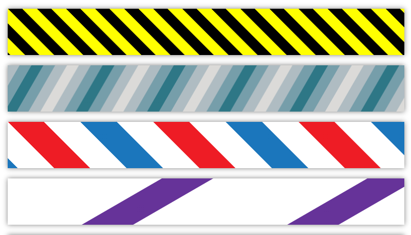

# Striped Background

> Generate customizable striped backgrounds using CSS gradients

### Usage

```js
import stripedBackground from 'striped-background';

const div = document.getElementById('my-div');

Object.assign(div.style, stripedBackground(
    [
        ['#ffffff', 40],
        ['rgb(244, 0, 39)', 30],
    ],
    '0.25turn',
    10,
));
```

With Vue:

```vue
<script>
import { computed } from 'vue';
import stripedBackground from 'striped-background';

const divStyle = computed(() => ({
  // ... other styles
  ...stripedBackground(
    [
      ['#ffffff', 40],
      ['rgb(244, 0, 39)', 30],
    ],
    '0.25turn',
    10,
  )
}));
</script>
<template>
  <div :style="divStyle"></div>
</template>
```

### Examples



For live examples visit [examples page](https://downace.github.io/striped-background/examples.html).

Or clone this repo and run local server:

```shell
npx http-server -o examples.html .
```
